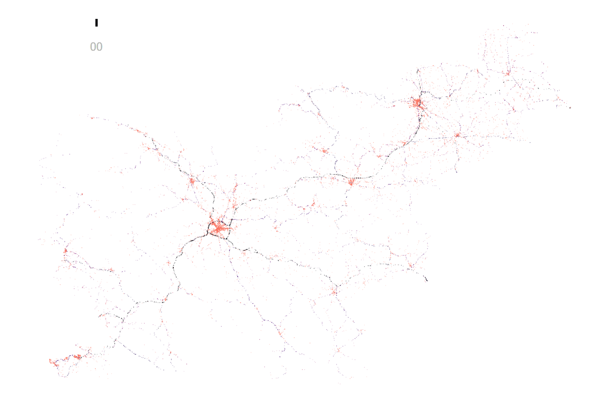

<!--style>
body {
/*  background-color: #fefefe;*/
  color: #222;
}
</style-->

<style>
pre code { font-size: 0.8rem; }
code { 
  line-height: 1.1; 
}
</style>


```{r setup, include=FALSE}
library(tufte)
# invalidate cache when the tufte version changes
knitr::opts_chunk$set(tidy = FALSE, cache.extra = packageVersion('tufte'))
options(htmltools.dir.version = FALSE)

knitr::opts_chunk$set(warning = FALSE, message = FALSE)

```

```{r packages, include=FALSE}
## devtools::install_github(bergant/trafficaccidents)
library(trafficaccidents)
#devtools::install_github("bergant/datamodelr")
library(datamodelr)
#library(tidyverse)
library(ggplot2)
library(viridis)
library(ggjoy)
library(dplyr)
library(tidyr)
library(rmarkdown)
library(knitr)


display_levels <- function(col_name) {
  event %>% 
    left_join(calendar, by = "date") %>% 
    filter(year %in% 2014:2016) %>% 
    group_by_(col_name, "year") %>% 
    summarise(Frequency = n()) %>% 
    spread(key = "year", "Frequency") %>% 
    kable(., row.names = TRUE, format.args = list(big.mark = ","))
}

```


# About

This tutorial is an overview of 
[`trafficaccidents`](https://github.com/bergant/trafficaccidents) data package. 
The package contains information about traffic accidents in Slovenia examined by
the [police](http://www.policija.si) from 2005 to 2016.
Original files^[The original data is published on
[http://www.policija.si/](http://www.policija.si/index.php/statistika/prometna-varnost)]
 were converted to R data frames without changes, except for:

- Additional accident geo positions in WGS 84
- Additional calendar table (with local holidays)
- Translation to English

The tutorial was created using R language [@R-base] and several R extensions.
See the list of all used packages at the [end](#packages) of the document.
<!--like ggplot2 [@R-ggplot2] and R Markdown [@R-rmarkdown].-->

Note that this is not a thorough analysis of traffic accidents. The only goal is
to bring the data and visualization tools to a larger group of users.


# Data Structure
Information about accidents is stored in three data frames: 

- `event` contains  accident events with date, time, position and other
accident attributes. 
- `party` contains attributes of the parties involved.
- `calendar` contains all dates from 
`r paste(lubridate::year(range(event$date)), collapse = " to ")`.

```{r diagram, fig.fullwidth = TRUE, cache=TRUE, fig.cap="Data structure", echo=FALSE, cache=TRUE}

  dm_from_data_frames(event, party, calendar) %>% 
  dm_add_references(
    party$src_file == event$src_file,
    party$event_id == event$event_id,
    event$date == calendar$date
  )  %>% 
  dm_create_graph(col_attr = c("column","type"), graph_attrs = "rankdir = LR") %>% 
  dm_render_graph


```


# Accident Locations

The majority  of accidents
(`r round(mean(as.numeric(!is.na(event$pos_x)))* 100)`%)
are geocoded. Use `pos_x` and `pos_y` columns for geographic location.^[
Columns `pos_x` and `pos_y` are geocoded in D48/GK coordinate reference system.
Use columns lon and lat for WGS84] 
For example, we can plot all accidents locations as points, coloured by 
road category (`road_type`):

```{r Slovenia, echo=TRUE, fig.cap="Traffic accidents locations by road category", cache=TRUE}

library(dplyr)
library(ggplot2)
library(viridis)
library(trafficaccidents)

dat_roads <- 
  event %>% 
  filter(!is.na(road_type), !is.na(pos_x)) %>% 
  arrange(desc(road_type))

ggplot(data = dat_roads, aes(pos_y, pos_x, color = road_type) ) +
  geom_point(alpha = 0.03, size = 0.2) +
  coord_fixed() +
  scale_color_viridis(discrete = TRUE, end = 0.7, option = "A") +
  guides(colour = guide_legend(
    override.aes = list(alpha = 1, size = 2), title = "Road category")) +
  theme_void() +
  theme(legend.position = c(0.95,0.3))

```


# Time

Working days have different time distribution than weekends and holidays.

```{r time_working_day, fig.margin = TRUE, fig.height=5, fig.width=3.5, cache = TRUE, echo = TRUE}
days_count <-
  calendar %>% 
  group_by(year, working_day) %>% 
  summarise(days = n())

accidents_per_hour <- 
  event %>% 
  left_join(calendar, by = "date") %>% 
  group_by(year, working_day, hour) %>% 
  count %>% 
  left_join(days_count, by = c("year", "working_day")) %>% 
  mutate(p = n / days)

ggplot(accidents_per_hour, aes(x = hour, y = p)) +
    geom_point(alpha = 0.2, size = 0.2, position = position_jitter(0.1)) +
    geom_smooth(method = "loess", span = 1/3, color = "gray") +
    scale_x_continuous(breaks = 1:7*3, name = "Hour", minor_breaks = NULL) +
    scale_y_continuous(limits = c(0, NA), breaks = 0:6 * 2, 
                       name = "Average number of accidents") +
    coord_cartesian(y=c(0, 9)) +
    facet_wrap(~ working_day, ncol = 1, scales = "fixed") + 
    theme_minimal()
    

```

# Commuting Pattern

With "joy plot" from `ggjoy` package [@R-ggjoy] we can 
discover the differences of time distributions between road categories.
The peaks at rush hour are more visible on roads than on city streets.

```{r joy_road_type, cache = TRUE, fig.margin = TRUE,fig.height=3.5, fig.width=3.5, fig.cap = "Time distribution of accidents on working day", echo = TRUE}

library(ggjoy)

dat_rt_wd <- 
  event %>% 
  left_join(calendar, by = "date") %>% 
  filter(
    working_day == "Working day", 
    !is.na(road_type)
  )

ggplot(dat_rt_wd) +
  geom_joy(aes(x = hour, y = road_type, fill = road_type), alpha = 0.5 ) +
  scale_x_continuous(breaks = 1:7*3, minor_breaks = NULL,
                     limits = c(0,23), name = "Hour") +
  scale_fill_viridis(discrete = TRUE, end = 0.7, option = "A")+
  scale_y_discrete(limits = rev(levels(dat_rt_wd$road_type)), name = NULL)+
  theme_minimal() +
  theme(legend.position = "none") 
  

```


# Time and Place

With animation it is possible to see accident locations by hour.
The following animation was created with gganimate package [@R-gganimate]. 

```{r, code = readLines('animation/animation.R')[-(1:3)], eval=FALSE}
```




# Severity

All accidents are marked with injury severity (column `injury`). The plot
below compares time distributions of accidents for different levels of
severities.

```{r joy_severity, fig.margin = TRUE, fig.height=6, fig.width=3.5, fig.cap = "Distribution of accidents over time", echo=TRUE, cache=TRUE}

dat <- 
  event %>% 
  left_join(calendar, by = "date")
  


ggplot(dat) +
  geom_joy(aes(x = hour, y = injury, alpha = injury), fill = "darkred") +
  scale_x_continuous(breaks = 1:7*3, minor_breaks = NULL, 
                     limits = c(0,23), name = "Hour") +
  scale_y_discrete(limits = rev(levels(dat$injury)), name = NULL)+
  scale_alpha_discrete(range = c(0.06, 0.7), guide = "none") +
  theme_minimal() +
  facet_wrap(~working_day, ncol = 1) 


```


# Cause

Police classifies each accident by main cause. The plot below
represent the number of accidents as a circle size and injury severity as color
opacity for different accident causes:

```{r causes, fig.fullwidth=TRUE, fig.height=6, cache=TRUE}
dat_type <- 
  event %>% 
  group_by(cause, injury) %>% 
  count 

ggplot(dat_type, aes(x = 1, y=1, size = sqrt(n) / 7, alpha = injury)) +
  scale_size_identity() +
  geom_point(color = "darkred") +
  scale_y_discrete(limits = rev(levels(dat_type$cause))) +
  coord_fixed(0.7) +
  scale_alpha_discrete(range = c(0.06, 0.7)) +
  guides(alpha = guide_legend(override.aes = list(size = 6))) +
  theme_void(base_size = 12) +
  #theme(strip.text = element_text(size = 10)) +
  labs(x = NULL, y = NULL, alpha = "Severity") +
  facet_wrap(~cause, ncol = 3)

```


# Causes and Accident Types

The `accident_type` column defines what happened (e.g. side collision or vehicle rollover).
The plot below explores its relation to accident cause.

```{r cause_types, fig.fullwidth = TRUE, fig.width=10, fig.height=10}
dat_cause_type <- 
  event %>% 
  group_by(cause, event_type, injury) %>% 
  count

ggplot(dat_cause_type, 
       aes(x = event_type, y=cause, size = sqrt(n) / 7, alpha = injury)) +
  geom_point(color = "darkred") +
  scale_size_identity() +
  scale_alpha_discrete(range = c(0.06, 0.7)) +
  guides(alpha = guide_legend(override.aes = list(size = 10))) +
  scale_x_discrete(position = "top") +
  scale_y_discrete(limits = rev(levels(dat_cause_type$cause))) +
  coord_fixed() +
  theme_minimal() +
  theme(
    axis.text.x = element_text(angle=90,hjust = 0, vjust = 0.3, size = 12),
    axis.text.y = element_text(size = 12),
    legend.position = "bottom"
  ) +
  labs(x = "Accident type", y = "Cause", alpha = "Severity")


```

# Parties

There can be several parties involved in same accident. The data
includes also some cases where there are several parties at fault for the
same accident. 
Here the `events_party` data frame is created with single 
event and some attributes from one party at fault.

```{r party_data, cache=TRUE}
party_at_fault <- 
  party %>% 
  filter(accident_role == "At fault") 

other_party <- 
  party %>% 
  filter(accident_role != "At fault") 

events_party <- 
  party_at_fault %>% 
  group_by(src_file, event_id) %>%
  summarise(
    age = first(age),
    gender = first(gender),
    alco =  first(alcotest)  > 0, 
    experience = first(experience_y) + first(experience_m)/12,
    traffic_role = first(traffic_role)
  )

events_party %>% 
  group_by(traffic_role) %>% 
  summarise(accidents = n()) %>% 
  arrange(desc(accidents)) %>% 
  head(8) %>% 
  kable

```


# Car Driver's Age

Most frequent parties at fault are car drivers. 
Is it true, that there are more accidents involving young drivers, 
driving at night?

```{r by_age, cache = TRUE, fig.cap="Number of accidents per year by car driver's age"}

hour_intervals <- setNames(
  c(0, 6, 22), 
  c("Night (22h - 06h)", "Day (6h-21h)", "Night (22h - 06h)")
)

events_party_car_drivers <-
  events_party %>% 
  filter(traffic_role %in% c("Car driver")) %>% 
  filter(age >= 18) %>% 
  inner_join(event, by = c("src_file", "event_id")) %>% 
  inner_join(calendar, by = "date") %>% 
  mutate(
    hour_interval = findInterval(hour, hour_intervals),
    hour_interval = names(hour_intervals)[hour_interval],
    age = round(age) 
  )

events_party_car_drivers %>% 
  filter(date >= as.Date("2011-01-01")) %>% 
  group_by(age, hour_interval, src_file) %>% 
  count %>% 
  
  ggplot(aes(x = age, y = n)) +
  #geom_point(alpha = 0.7) +
  geom_point(alpha = 0.5, mapping = aes(color = src_file)) +
  geom_smooth(alpha = 0.2, method = "loess") +
  facet_wrap(~hour_interval, scales = "free_y") +
  labs(x = "Age", y = "Number of accidents", color = NULL) +
  scale_x_continuous(breaks = 1:10*10, limits = c(18, 85)) +
  scale_color_brewer(palette = "Blues") +
  theme_bw()

```

# Alcohol Involved Accidents by Age

Alcohol involved accidents, number of accidents by age at day/night:

```{r alco_fig, fig.cap="Number of alcohol induced accidents per year, by car driver age"}

  
events_party_car_drivers %>% 
  filter(date >= as.Date("2011-01-01"), alco) %>% 
  group_by(age, hour_interval, src_file) %>% 
  count %>% 
  
  ggplot(aes(x = age, y = n)) +
  #geom_point(alpha = 0.7) +
  geom_point(alpha = 0.3, mapping = aes(color = src_file)) +
  geom_smooth(method = "loess", color = "orange", span = 0.6) +
  facet_wrap(~hour_interval) +
  labs(x = "Age", y = "Number of accidents", color = NULL) +
  scale_x_continuous(breaks = 1:10*10, limits = c(18, 80)) +
  scale_color_brewer(palette = "Oranges") +
  theme_bw()+
  theme(legend.position = "none")

```


<a name="packages"/>

# R Packages

```{r results='asis', echo=FALSE}
for(p in sessionInfo()$otherPkgs)  {
  cat(sep = "",
    "**", p$Package, "** ", p$Version, "\n\n ",
    format(citation(package = p$Package)[[1]], style = "html"),
    "\n\n"
  )
}

```

