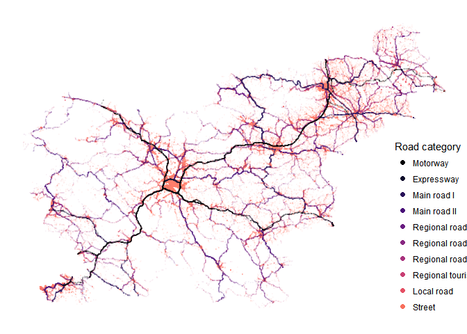
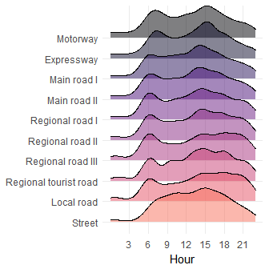
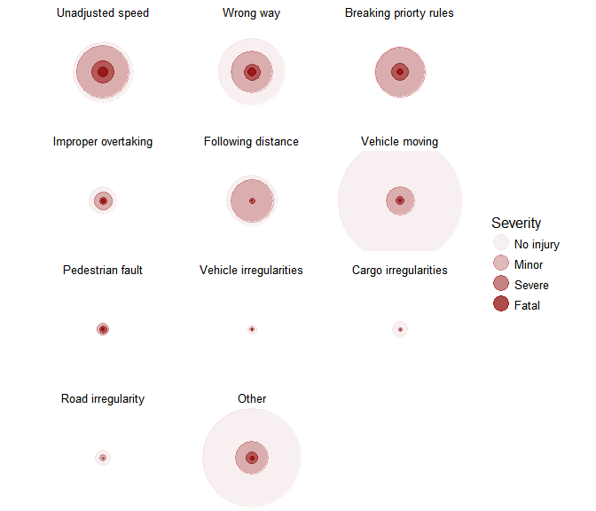
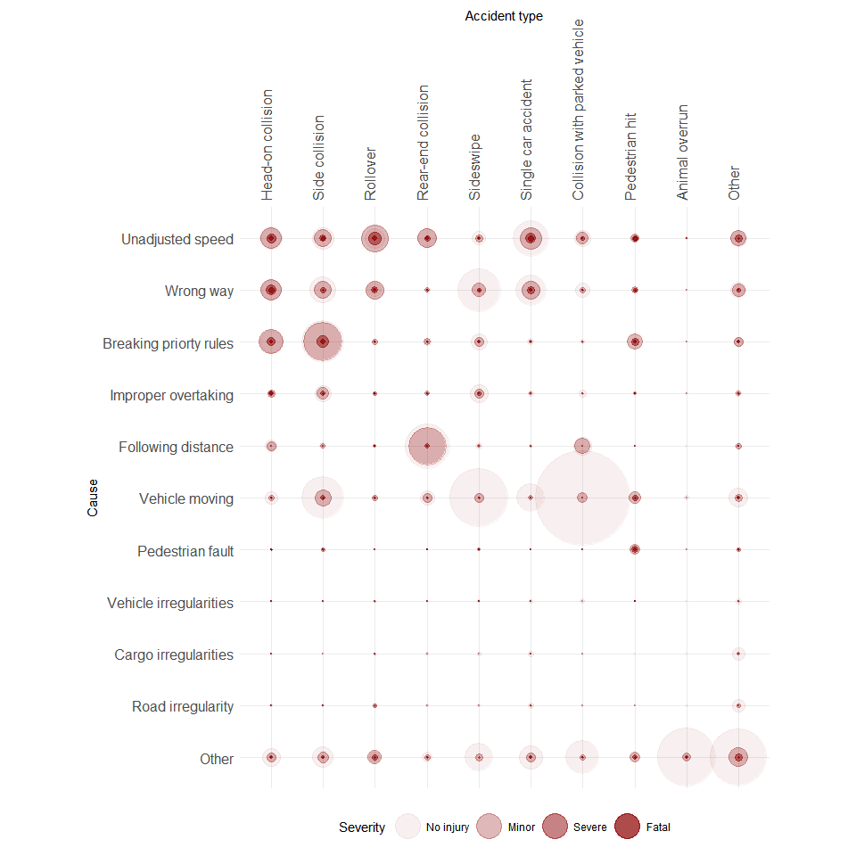
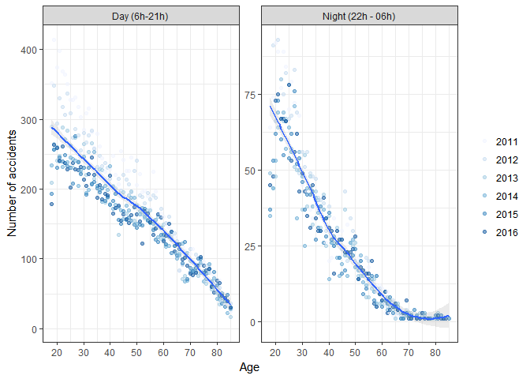
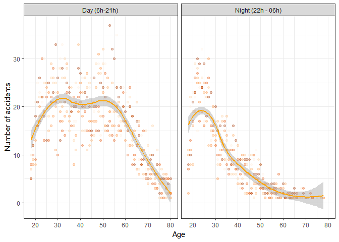

# Traffic Accidents in Slovenia
Darko Bergant  
August 2017  

<!--style>
body {
/*  background-color: #fefefe;*/
  color: #222;
}
</style-->

<style>
pre code { font-size: 0.8rem; }
code { 
  line-height: 1.1; 
}
</style>


# About

This tutorial is an overview of 
[`trafficaccidents`](https://github.com/bergant/trafficaccidents) data package. 
The package contains information about traffic accidents in Slovenia examined by
the [police](http://www.policija.si) from 2005 to 2016.
Original files^[The original data is published on
[http://www.policija.si/](http://www.policija.si/index.php/statistika/prometna-varnost)]
 were converted to R data frames without changes, except for:

- Additional accident geo positions in WGS 84
- Additional calendar table (with local holidays)
- Translation to English

The tutorial was created using R language [@R-base] and several R extensions.
See the list of all used packages at the [end](#packages) of the document.
<!--like ggplot2 [@R-ggplot2] and R Markdown [@R-rmarkdown].-->

Note that this is not a thorough analysis of traffic accidents. The only goal is
to bring the data and visualization tools to a larger group of users.


# Data Structure
Information about accidents is stored in three data frames: 

- `event` contains  accident events with date, time, position and other
accident attributes. 
- `party` contains attributes of the parties involved.
- `calendar` contains all dates from 
2005 to 2016.

<div class="figure">
<!--html_preserve--><div id="htmlwidget-6f28bb5216457ab214a8" style="width:672px;height:480px;" class="grViz html-widget"></div>
<script type="application/json" data-for="htmlwidget-6f28bb5216457ab214a8">{"x":{"diagram":"#data_model\ndigraph {\ngraph [rankdir=BT tooltip=\"Data Model\" rankdir = LR]\n\nnode [margin=0 fontcolor = \"#444444\" ]\n\nedge [color = \"#555555\", arrowsize = 1, ]\n\n\n  \"calendar\" [label = <<TABLE ALIGN=\"LEFT\" BORDER=\"1\" CELLBORDER=\"0\" CELLSPACING=\"0\" COLOR=\"#555555\">\n    <TR>\n      <TD COLSPAN=\"3\" BGCOLOR=\"#EFEBDD\" BORDER=\"0\"><FONT COLOR=\"#000000\">calendar<\/FONT>\n<\/TD>\n    <\/TR>\n    <TR>\n      <TD ALIGN=\"LEFT\" BGCOLOR=\"#FFFFFF\"><\/TD>\n      <TD ALIGN=\"LEFT\" BGCOLOR=\"#FFFFFF\"><U>date<\/U><\/TD>\n      <TD ALIGN=\"LEFT\" BGCOLOR=\"#FFFFFF\">Date<\/TD>\n    <\/TR>\n    <TR>\n      <TD ALIGN=\"LEFT\" BGCOLOR=\"#FFFFFF\"><\/TD>\n      <TD ALIGN=\"LEFT\" BGCOLOR=\"#FFFFFF\">date_POSIXct<\/TD>\n      <TD ALIGN=\"LEFT\" BGCOLOR=\"#FFFFFF\">POSIXct, POSIXt<\/TD>\n    <\/TR>\n    <TR>\n      <TD ALIGN=\"LEFT\" BGCOLOR=\"#FFFFFF\"><\/TD>\n      <TD ALIGN=\"LEFT\" BGCOLOR=\"#FFFFFF\">year<\/TD>\n      <TD ALIGN=\"LEFT\" BGCOLOR=\"#FFFFFF\">numeric<\/TD>\n    <\/TR>\n    <TR>\n      <TD ALIGN=\"LEFT\" BGCOLOR=\"#FFFFFF\"><\/TD>\n      <TD ALIGN=\"LEFT\" BGCOLOR=\"#FFFFFF\">month<\/TD>\n      <TD ALIGN=\"LEFT\" BGCOLOR=\"#FFFFFF\">numeric<\/TD>\n    <\/TR>\n    <TR>\n      <TD ALIGN=\"LEFT\" BGCOLOR=\"#FFFFFF\"><\/TD>\n      <TD ALIGN=\"LEFT\" BGCOLOR=\"#FFFFFF\">day<\/TD>\n      <TD ALIGN=\"LEFT\" BGCOLOR=\"#FFFFFF\">integer<\/TD>\n    <\/TR>\n    <TR>\n      <TD ALIGN=\"LEFT\" BGCOLOR=\"#FFFFFF\"><\/TD>\n      <TD ALIGN=\"LEFT\" BGCOLOR=\"#FFFFFF\">wday<\/TD>\n      <TD ALIGN=\"LEFT\" BGCOLOR=\"#FFFFFF\">numeric<\/TD>\n    <\/TR>\n    <TR>\n      <TD ALIGN=\"LEFT\" BGCOLOR=\"#FFFFFF\"><\/TD>\n      <TD ALIGN=\"LEFT\" BGCOLOR=\"#FFFFFF\">year_day<\/TD>\n      <TD ALIGN=\"LEFT\" BGCOLOR=\"#FFFFFF\">numeric<\/TD>\n    <\/TR>\n    <TR>\n      <TD ALIGN=\"LEFT\" BGCOLOR=\"#FFFFFF\"><\/TD>\n      <TD ALIGN=\"LEFT\" BGCOLOR=\"#FFFFFF\">working_day<\/TD>\n      <TD ALIGN=\"LEFT\" BGCOLOR=\"#FFFFFF\">factor<\/TD>\n    <\/TR>\n  <\/TABLE>>, shape = \"plaintext\"] \n\n  \"event\" [label = <<TABLE ALIGN=\"LEFT\" BORDER=\"1\" CELLBORDER=\"0\" CELLSPACING=\"0\" COLOR=\"#555555\">\n    <TR>\n      <TD COLSPAN=\"3\" BGCOLOR=\"#EFEBDD\" BORDER=\"0\"><FONT COLOR=\"#000000\">event<\/FONT>\n<\/TD>\n    <\/TR>\n    <TR>\n      <TD ALIGN=\"LEFT\" BGCOLOR=\"#FFFFFF\"><\/TD>\n      <TD ALIGN=\"LEFT\" BGCOLOR=\"#FFFFFF\"><U>src_file<\/U><\/TD>\n      <TD ALIGN=\"LEFT\" BGCOLOR=\"#FFFFFF\">character<\/TD>\n    <\/TR>\n    <TR>\n      <TD ALIGN=\"LEFT\" BGCOLOR=\"#FFFFFF\"><\/TD>\n      <TD ALIGN=\"LEFT\" BGCOLOR=\"#FFFFFF\"><U>event_id<\/U><\/TD>\n      <TD ALIGN=\"LEFT\" BGCOLOR=\"#FFFFFF\">integer<\/TD>\n    <\/TR>\n    <TR>\n      <TD ALIGN=\"LEFT\" BGCOLOR=\"#FFFFFF\"><\/TD>\n      <TD ALIGN=\"LEFT\" BGCOLOR=\"#FFFFFF\">injury<\/TD>\n      <TD ALIGN=\"LEFT\" BGCOLOR=\"#FFFFFF\">factor<\/TD>\n    <\/TR>\n    <TR>\n      <TD ALIGN=\"LEFT\" BGCOLOR=\"#FFFFFF\">~<\/TD>\n      <TD ALIGN=\"LEFT\" BGCOLOR=\"#FFFFFF\">date<\/TD>\n      <TD ALIGN=\"LEFT\" BGCOLOR=\"#FFFFFF\">Date<\/TD>\n    <\/TR>\n    <TR>\n      <TD ALIGN=\"LEFT\" BGCOLOR=\"#FFFFFF\"><\/TD>\n      <TD ALIGN=\"LEFT\" BGCOLOR=\"#FFFFFF\">hour<\/TD>\n      <TD ALIGN=\"LEFT\" BGCOLOR=\"#FFFFFF\">integer<\/TD>\n    <\/TR>\n    <TR>\n      <TD ALIGN=\"LEFT\" BGCOLOR=\"#FFFFFF\"><\/TD>\n      <TD ALIGN=\"LEFT\" BGCOLOR=\"#FFFFFF\">in_city<\/TD>\n      <TD ALIGN=\"LEFT\" BGCOLOR=\"#FFFFFF\">factor<\/TD>\n    <\/TR>\n    <TR>\n      <TD ALIGN=\"LEFT\" BGCOLOR=\"#FFFFFF\"><\/TD>\n      <TD ALIGN=\"LEFT\" BGCOLOR=\"#FFFFFF\">road_type<\/TD>\n      <TD ALIGN=\"LEFT\" BGCOLOR=\"#FFFFFF\">factor<\/TD>\n    <\/TR>\n    <TR>\n      <TD ALIGN=\"LEFT\" BGCOLOR=\"#FFFFFF\"><\/TD>\n      <TD ALIGN=\"LEFT\" BGCOLOR=\"#FFFFFF\">location_id<\/TD>\n      <TD ALIGN=\"LEFT\" BGCOLOR=\"#FFFFFF\">factor<\/TD>\n    <\/TR>\n    <TR>\n      <TD ALIGN=\"LEFT\" BGCOLOR=\"#FFFFFF\"><\/TD>\n      <TD ALIGN=\"LEFT\" BGCOLOR=\"#FFFFFF\">road_section_id<\/TD>\n      <TD ALIGN=\"LEFT\" BGCOLOR=\"#FFFFFF\">factor<\/TD>\n    <\/TR>\n    <TR>\n      <TD ALIGN=\"LEFT\" BGCOLOR=\"#FFFFFF\"><\/TD>\n      <TD ALIGN=\"LEFT\" BGCOLOR=\"#FFFFFF\">pos_number<\/TD>\n      <TD ALIGN=\"LEFT\" BGCOLOR=\"#FFFFFF\">integer<\/TD>\n    <\/TR>\n    <TR>\n      <TD ALIGN=\"LEFT\" BGCOLOR=\"#FFFFFF\"><\/TD>\n      <TD ALIGN=\"LEFT\" BGCOLOR=\"#FFFFFF\">location_type<\/TD>\n      <TD ALIGN=\"LEFT\" BGCOLOR=\"#FFFFFF\">factor<\/TD>\n    <\/TR>\n    <TR>\n      <TD ALIGN=\"LEFT\" BGCOLOR=\"#FFFFFF\"><\/TD>\n      <TD ALIGN=\"LEFT\" BGCOLOR=\"#FFFFFF\">cause<\/TD>\n      <TD ALIGN=\"LEFT\" BGCOLOR=\"#FFFFFF\">factor<\/TD>\n    <\/TR>\n    <TR>\n      <TD ALIGN=\"LEFT\" BGCOLOR=\"#FFFFFF\"><\/TD>\n      <TD ALIGN=\"LEFT\" BGCOLOR=\"#FFFFFF\">event_type<\/TD>\n      <TD ALIGN=\"LEFT\" BGCOLOR=\"#FFFFFF\">factor<\/TD>\n    <\/TR>\n    <TR>\n      <TD ALIGN=\"LEFT\" BGCOLOR=\"#FFFFFF\"><\/TD>\n      <TD ALIGN=\"LEFT\" BGCOLOR=\"#FFFFFF\">weather<\/TD>\n      <TD ALIGN=\"LEFT\" BGCOLOR=\"#FFFFFF\">factor<\/TD>\n    <\/TR>\n    <TR>\n      <TD ALIGN=\"LEFT\" BGCOLOR=\"#FFFFFF\"><\/TD>\n      <TD ALIGN=\"LEFT\" BGCOLOR=\"#FFFFFF\">traffic<\/TD>\n      <TD ALIGN=\"LEFT\" BGCOLOR=\"#FFFFFF\">factor<\/TD>\n    <\/TR>\n    <TR>\n      <TD ALIGN=\"LEFT\" BGCOLOR=\"#FFFFFF\"><\/TD>\n      <TD ALIGN=\"LEFT\" BGCOLOR=\"#FFFFFF\">surface_conditions<\/TD>\n      <TD ALIGN=\"LEFT\" BGCOLOR=\"#FFFFFF\">factor<\/TD>\n    <\/TR>\n    <TR>\n      <TD ALIGN=\"LEFT\" BGCOLOR=\"#FFFFFF\"><\/TD>\n      <TD ALIGN=\"LEFT\" BGCOLOR=\"#FFFFFF\">surface<\/TD>\n      <TD ALIGN=\"LEFT\" BGCOLOR=\"#FFFFFF\">factor<\/TD>\n    <\/TR>\n    <TR>\n      <TD ALIGN=\"LEFT\" BGCOLOR=\"#FFFFFF\"><\/TD>\n      <TD ALIGN=\"LEFT\" BGCOLOR=\"#FFFFFF\">pos_x<\/TD>\n      <TD ALIGN=\"LEFT\" BGCOLOR=\"#FFFFFF\">integer<\/TD>\n    <\/TR>\n    <TR>\n      <TD ALIGN=\"LEFT\" BGCOLOR=\"#FFFFFF\"><\/TD>\n      <TD ALIGN=\"LEFT\" BGCOLOR=\"#FFFFFF\">pos_y<\/TD>\n      <TD ALIGN=\"LEFT\" BGCOLOR=\"#FFFFFF\">integer<\/TD>\n    <\/TR>\n    <TR>\n      <TD ALIGN=\"LEFT\" BGCOLOR=\"#FFFFFF\"><\/TD>\n      <TD ALIGN=\"LEFT\" BGCOLOR=\"#FFFFFF\">lon<\/TD>\n      <TD ALIGN=\"LEFT\" BGCOLOR=\"#FFFFFF\">numeric<\/TD>\n    <\/TR>\n    <TR>\n      <TD ALIGN=\"LEFT\" BGCOLOR=\"#FFFFFF\"><\/TD>\n      <TD ALIGN=\"LEFT\" BGCOLOR=\"#FFFFFF\">lat<\/TD>\n      <TD ALIGN=\"LEFT\" BGCOLOR=\"#FFFFFF\">numeric<\/TD>\n    <\/TR>\n  <\/TABLE>>, shape = \"plaintext\"] \n\n  \"party\" [label = <<TABLE ALIGN=\"LEFT\" BORDER=\"1\" CELLBORDER=\"0\" CELLSPACING=\"0\" COLOR=\"#555555\">\n    <TR>\n      <TD COLSPAN=\"3\" BGCOLOR=\"#EFEBDD\" BORDER=\"0\"><FONT COLOR=\"#000000\">party<\/FONT>\n<\/TD>\n    <\/TR>\n    <TR>\n      <TD ALIGN=\"LEFT\" BGCOLOR=\"#FFFFFF\">~<\/TD>\n      <TD ALIGN=\"LEFT\" BGCOLOR=\"#FFFFFF\">src_file<\/TD>\n      <TD ALIGN=\"LEFT\" BGCOLOR=\"#FFFFFF\">character<\/TD>\n    <\/TR>\n    <TR>\n      <TD ALIGN=\"LEFT\" BGCOLOR=\"#FFFFFF\">~<\/TD>\n      <TD ALIGN=\"LEFT\" BGCOLOR=\"#FFFFFF\">event_id<\/TD>\n      <TD ALIGN=\"LEFT\" BGCOLOR=\"#FFFFFF\">integer<\/TD>\n    <\/TR>\n    <TR>\n      <TD ALIGN=\"LEFT\" BGCOLOR=\"#FFFFFF\"><\/TD>\n      <TD ALIGN=\"LEFT\" BGCOLOR=\"#FFFFFF\">accident_role<\/TD>\n      <TD ALIGN=\"LEFT\" BGCOLOR=\"#FFFFFF\">factor<\/TD>\n    <\/TR>\n    <TR>\n      <TD ALIGN=\"LEFT\" BGCOLOR=\"#FFFFFF\"><\/TD>\n      <TD ALIGN=\"LEFT\" BGCOLOR=\"#FFFFFF\">age<\/TD>\n      <TD ALIGN=\"LEFT\" BGCOLOR=\"#FFFFFF\">integer<\/TD>\n    <\/TR>\n    <TR>\n      <TD ALIGN=\"LEFT\" BGCOLOR=\"#FFFFFF\"><\/TD>\n      <TD ALIGN=\"LEFT\" BGCOLOR=\"#FFFFFF\">gender<\/TD>\n      <TD ALIGN=\"LEFT\" BGCOLOR=\"#FFFFFF\">factor<\/TD>\n    <\/TR>\n    <TR>\n      <TD ALIGN=\"LEFT\" BGCOLOR=\"#FFFFFF\"><\/TD>\n      <TD ALIGN=\"LEFT\" BGCOLOR=\"#FFFFFF\">country<\/TD>\n      <TD ALIGN=\"LEFT\" BGCOLOR=\"#FFFFFF\">factor<\/TD>\n    <\/TR>\n    <TR>\n      <TD ALIGN=\"LEFT\" BGCOLOR=\"#FFFFFF\"><\/TD>\n      <TD ALIGN=\"LEFT\" BGCOLOR=\"#FFFFFF\">p_injury<\/TD>\n      <TD ALIGN=\"LEFT\" BGCOLOR=\"#FFFFFF\">factor<\/TD>\n    <\/TR>\n    <TR>\n      <TD ALIGN=\"LEFT\" BGCOLOR=\"#FFFFFF\"><\/TD>\n      <TD ALIGN=\"LEFT\" BGCOLOR=\"#FFFFFF\">traffic_role<\/TD>\n      <TD ALIGN=\"LEFT\" BGCOLOR=\"#FFFFFF\">factor<\/TD>\n    <\/TR>\n    <TR>\n      <TD ALIGN=\"LEFT\" BGCOLOR=\"#FFFFFF\"><\/TD>\n      <TD ALIGN=\"LEFT\" BGCOLOR=\"#FFFFFF\">seat_belt_or_helmet<\/TD>\n      <TD ALIGN=\"LEFT\" BGCOLOR=\"#FFFFFF\">factor<\/TD>\n    <\/TR>\n    <TR>\n      <TD ALIGN=\"LEFT\" BGCOLOR=\"#FFFFFF\"><\/TD>\n      <TD ALIGN=\"LEFT\" BGCOLOR=\"#FFFFFF\">experience_y<\/TD>\n      <TD ALIGN=\"LEFT\" BGCOLOR=\"#FFFFFF\">integer<\/TD>\n    <\/TR>\n    <TR>\n      <TD ALIGN=\"LEFT\" BGCOLOR=\"#FFFFFF\"><\/TD>\n      <TD ALIGN=\"LEFT\" BGCOLOR=\"#FFFFFF\">experience_m<\/TD>\n      <TD ALIGN=\"LEFT\" BGCOLOR=\"#FFFFFF\">integer<\/TD>\n    <\/TR>\n    <TR>\n      <TD ALIGN=\"LEFT\" BGCOLOR=\"#FFFFFF\"><\/TD>\n      <TD ALIGN=\"LEFT\" BGCOLOR=\"#FFFFFF\">alcotest<\/TD>\n      <TD ALIGN=\"LEFT\" BGCOLOR=\"#FFFFFF\">numeric<\/TD>\n    <\/TR>\n    <TR>\n      <TD ALIGN=\"LEFT\" BGCOLOR=\"#FFFFFF\"><\/TD>\n      <TD ALIGN=\"LEFT\" BGCOLOR=\"#FFFFFF\">alco_exam<\/TD>\n      <TD ALIGN=\"LEFT\" BGCOLOR=\"#FFFFFF\">numeric<\/TD>\n    <\/TR>\n    <TR>\n      <TD ALIGN=\"LEFT\" BGCOLOR=\"#FFFFFF\"><\/TD>\n      <TD ALIGN=\"LEFT\" BGCOLOR=\"#FFFFFF\">country_iso<\/TD>\n      <TD ALIGN=\"LEFT\" BGCOLOR=\"#FFFFFF\">factor<\/TD>\n    <\/TR>\n  <\/TABLE>>, shape = \"plaintext\"] \n\n\"event\"->\"calendar\"\n\"party\"->\"event\"\n}","config":{"engine":null,"options":null}},"evals":[],"jsHooks":[]}</script><!--/html_preserve-->
<p class="caption">Data structure</p>
</div>


# Accident Locations

The majority  of accidents
(93%)
are geocoded. Use `pos_x` and `pos_y` columns for geographic location.^[
Columns `pos_x` and `pos_y` are geocoded in D48/GK coordinate reference system.
Use columns lon and lat for WGS84] 
For example, we can plot all accidents locations as points, coloured by 
road category (`road_type`):


```r
library(dplyr)
library(ggplot2)
library(viridis)
library(trafficaccidents)

dat_roads <- 
  event %>% 
  filter(!is.na(road_type), !is.na(pos_x)) %>% 
  arrange(desc(road_type))

ggplot(data = dat_roads, aes(pos_y, pos_x, color = road_type) ) +
  geom_point(alpha = 0.03, size = 0.2) +
  coord_fixed() +
  scale_color_viridis(discrete = TRUE, end = 0.7, option = "A") +
  guides(colour = guide_legend(
    override.aes = list(alpha = 1, size = 2), title = "Road category")) +
  theme_void() +
  theme(legend.position = c(0.95,0.3))
```

<div class="figure">
<p class="caption">Traffic accidents locations by road category</p></div>


# Time

Working days have different time distribution than weekends and holidays.

<p><span class="marginnote shownote"><!--
<div class="figure">-->

<!--
<p class="caption marginnote">--> <!--</p>-->
<!--</div>--></span></p>

```r
days_count <-
  calendar %>% 
  group_by(year, working_day) %>% 
  summarise(days = n())

accidents_per_hour <- 
  event %>% 
  left_join(calendar, by = "date") %>% 
  group_by(year, working_day, hour) %>% 
  count %>% 
  left_join(days_count, by = c("year", "working_day")) %>% 
  mutate(p = n / days)

ggplot(accidents_per_hour, aes(x = hour, y = p)) +
    geom_point(alpha = 0.2, size = 0.2, position = position_jitter(0.1)) +
    geom_smooth(method = "loess", span = 1/3, color = "gray") +
    scale_x_continuous(breaks = 1:7*3, name = "Hour", minor_breaks = NULL) +
    scale_y_continuous(limits = c(0, NA), breaks = 0:6 * 2, 
                       name = "Average number of accidents") +
    coord_cartesian(y=c(0, 9)) +
    facet_wrap(~ working_day, ncol = 1, scales = "fixed") + 
    theme_minimal()
```

# Commuting Pattern

With "joy plot" from `ggjoy` package [@R-ggjoy] we can 
discover the differences of time distributions between road categories.
The peaks at rush hour are more visible on roads than on city streets.

<p><span class="marginnote shownote"><!--
<div class="figure">-->

<!--
<p class="caption marginnote">-->Time distribution of accidents on working day<!--</p>-->
<!--</div>--></span></p>

```r
library(ggjoy)

dat_rt_wd <- 
  event %>% 
  left_join(calendar, by = "date") %>% 
  filter(
    working_day == "Working day", 
    !is.na(road_type)
  )

ggplot(dat_rt_wd) +
  geom_joy(aes(x = hour, y = road_type, fill = road_type), alpha = 0.5 ) +
  scale_x_continuous(breaks = 1:7*3, minor_breaks = NULL,
                     limits = c(0,23), name = "Hour") +
  scale_fill_viridis(discrete = TRUE, end = 0.7, option = "A")+
  scale_y_discrete(limits = rev(levels(dat_rt_wd$road_type)), name = NULL)+
  theme_minimal() +
  theme(legend.position = "none") 
```


# Time and Place

With animation it is possible to see accident locations by hour.
The following animation was created with gganimate package [@R-gganimate]. 


```r
event_wd <-
  event %>%
  filter(!is.na(pos_x)) %>%
  mutate(alpha = 0.2) %>%
  left_join(calendar, by = "date") %>%
  filter(working_day == "Working day")

shift_hour <- function(x, n, a) {
  mutate(x, alpha = a, hour = (hour + n) %% 24)
}

dat_wd_shift <-
  bind_rows(
    event_wd, shift_hour(event_wd, 1, 0.1), shift_hour(event_wd, 2, 0.07)
  ) %>%
  arrange(hour, desc(road_type))

clock <- list(x = 378938 + 30000, y = 191590 - 10000, width = 8500)

p1 <-
  ggplot(data = dat_wd_shift, aes(frame = hour)) +
  geom_point(aes(pos_y, pos_x, alpha = alpha, color = road_type), size = 0.4) +
  scale_alpha_identity() +
  scale_color_viridis(discrete = TRUE, end = 0.7, option = "A", guide = "none",
                      limits = levels(dat_wd_shift$road_type)) +
  coord_fixed() +
  geom_text(aes(label = sprintf("%02d", hour)), color = "gray",
            x = clock$x, y = clock$y, size = 9) +
  geom_segment(size = 2, aes(
    x = clock$x + clock$width * sin(hour/6 * pi),
    y = clock$y + clock$width * cos(hour/6 * pi),
    xend = clock$x + clock$width*1.4 * sin(hour/6 * pi),
    yend = clock$y + clock$width*1.4 * cos(hour/6 * pi),
    color = levels(dat_wd_shift$road_type)[as.integer(hour >= 12)*8+1]
  )) +
  theme_void()


library(gganimate)
library(animation)

magickPath <- shortPathName("magick.exe")
ani.options(convert=magickPath)
#ani.options(ani.width = 1024, ani.height = 640+55)
ani.options(ani.width = 1024*1.3, ani.height = (640+55)*1.3)
ani.options(interval = 0.1)
gganimate(p1, "docs/animation/accidents_animation.gif", title_frame = FALSE )
```


# Severity

All accidents are marked with injury severity (column `injury`). The plot
below compares time distributions of accidents for different levels of
severities.

<p><span class="marginnote shownote"><!--
<div class="figure">-->

<!--
<p class="caption marginnote">-->Distribution of accidents over time<!--</p>-->
<!--</div>--></span></p>

```r
dat <- 
  event %>% 
  left_join(calendar, by = "date")
  


ggplot(dat) +
  geom_joy(aes(x = hour, y = injury, alpha = injury), fill = "darkred") +
  scale_x_continuous(breaks = 1:7*3, minor_breaks = NULL, 
                     limits = c(0,23), name = "Hour") +
  scale_y_discrete(limits = rev(levels(dat$injury)), name = NULL)+
  scale_alpha_discrete(range = c(0.06, 0.7), guide = "none") +
  theme_minimal() +
  facet_wrap(~working_day, ncol = 1) 
```


# Cause

Police classifies each accident by main cause. The plot below
represent the number of accidents as a circle size and injury severity as color
opacity for different accident causes:


```r
dat_type <- 
  event %>% 
  group_by(cause, injury) %>% 
  count 

ggplot(dat_type, aes(x = 1, y=1, size = sqrt(n) / 7, alpha = injury)) +
  scale_size_identity() +
  geom_point(color = "darkred") +
  scale_y_discrete(limits = rev(levels(dat_type$cause))) +
  coord_fixed(0.7) +
  scale_alpha_discrete(range = c(0.06, 0.7)) +
  guides(alpha = guide_legend(override.aes = list(size = 6))) +
  theme_void(base_size = 12) +
  #theme(strip.text = element_text(size = 10)) +
  labs(x = NULL, y = NULL, alpha = "Severity") +
  facet_wrap(~cause, ncol = 3)
```

<div class="figure fullwidth">

<p class="caption marginnote shownote"> </p>
</div>


# Causes and Accident Types

The `accident_type` column defines what happened (e.g. side collision or vehicle rollover).
The plot below explores its relation to accident cause.


```r
dat_cause_type <- 
  event %>% 
  group_by(cause, event_type, injury) %>% 
  count

ggplot(dat_cause_type, 
       aes(x = event_type, y=cause, size = sqrt(n) / 7, alpha = injury)) +
  geom_point(color = "darkred") +
  scale_size_identity() +
  scale_alpha_discrete(range = c(0.06, 0.7)) +
  guides(alpha = guide_legend(override.aes = list(size = 10))) +
  scale_x_discrete(position = "top") +
  scale_y_discrete(limits = rev(levels(dat_cause_type$cause))) +
  coord_fixed() +
  theme_minimal() +
  theme(
    axis.text.x = element_text(angle=90,hjust = 0, vjust = 0.3, size = 12),
    axis.text.y = element_text(size = 12),
    legend.position = "bottom"
  ) +
  labs(x = "Accident type", y = "Cause", alpha = "Severity")
```

<div class="figure fullwidth">

<p class="caption marginnote shownote"> </p>
</div>

# Parties

There can be several parties involved in same accident. The data
includes also some cases where there are several parties at fault for the
same accident. 
Here the `events_party` data frame is created with single 
event and some attributes from one party at fault.


```r
party_at_fault <- 
  party %>% 
  filter(accident_role == "At fault") 

other_party <- 
  party %>% 
  filter(accident_role != "At fault") 

events_party <- 
  party_at_fault %>% 
  group_by(src_file, event_id) %>%
  summarise(
    age = first(age),
    gender = first(gender),
    alco =  first(alcotest)  > 0, 
    experience = first(experience_y) + first(experience_m)/12,
    traffic_role = first(traffic_role)
  )

events_party %>% 
  group_by(traffic_role) %>% 
  summarise(accidents = n()) %>% 
  arrange(desc(accidents)) %>% 
  head(8) %>% 
  kable
```


traffic_role                accidents
-------------------------  ----------
Car driver                     192340
Truck driver                    24174
Cyclist                          7862
Motorcycle driver                5290
Motorized bicycle driver         3344
Bus driver                       1704
Pedestrian                       1637
Tractor driver                   1492


# Car Driver's Age

Most frequent parties at fault are car drivers. 
Is it true, that there are more accidents involving young drivers, 
driving at night?


```r
hour_intervals <- setNames(
  c(0, 6, 22), 
  c("Night (22h - 06h)", "Day (6h-21h)", "Night (22h - 06h)")
)

events_party_car_drivers <-
  events_party %>% 
  filter(traffic_role %in% c("Car driver")) %>% 
  filter(age >= 18) %>% 
  inner_join(event, by = c("src_file", "event_id")) %>% 
  inner_join(calendar, by = "date") %>% 
  mutate(
    hour_interval = findInterval(hour, hour_intervals),
    hour_interval = names(hour_intervals)[hour_interval],
    age = round(age) 
  )

events_party_car_drivers %>% 
  filter(date >= as.Date("2011-01-01")) %>% 
  group_by(age, hour_interval, src_file) %>% 
  count %>% 
  
  ggplot(aes(x = age, y = n)) +
  #geom_point(alpha = 0.7) +
  geom_point(alpha = 0.5, mapping = aes(color = src_file)) +
  geom_smooth(alpha = 0.2, method = "loess") +
  facet_wrap(~hour_interval, scales = "free_y") +
  labs(x = "Age", y = "Number of accidents", color = NULL) +
  scale_x_continuous(breaks = 1:10*10, limits = c(18, 85)) +
  scale_color_brewer(palette = "Blues") +
  theme_bw()
```

<div class="figure">
<p class="caption">Number of accidents per year by car driver's age</p></div>

# Alcohol Involved Accidents by Age

Alcohol involved accidents, number of accidents by age at day/night:


```r
events_party_car_drivers %>% 
  filter(date >= as.Date("2011-01-01"), alco) %>% 
  group_by(age, hour_interval, src_file) %>% 
  count %>% 
  
  ggplot(aes(x = age, y = n)) +
  #geom_point(alpha = 0.7) +
  geom_point(alpha = 0.3, mapping = aes(color = src_file)) +
  geom_smooth(method = "loess", color = "orange", span = 0.6) +
  facet_wrap(~hour_interval) +
  labs(x = "Age", y = "Number of accidents", color = NULL) +
  scale_x_continuous(breaks = 1:10*10, limits = c(18, 80)) +
  scale_color_brewer(palette = "Oranges") +
  theme_bw()+
  theme(legend.position = "none")
```

<div class="figure">
<p class="caption">Number of alcohol induced accidents per year, by car driver age</p></div>


<a name="packages"/>

# R Packages

**knitr** 1.16

 <p>Xie Y (2017).
<em>knitr: A General-Purpose Package for Dynamic Report Generation in R</em>.
R package version 1.16, <a href="http://yihui.name/knitr/">http://yihui.name/knitr/</a>. 
</p>

**rmarkdown** 1.5

 <p>Allaire J, Cheng J, Xie Y, McPherson J, Chang W, Allen J, Wickham H, Atkins A, Hyndman R and Arslan R (2017).
<em>rmarkdown: Dynamic Documents for R</em>.
R package version 1.5, <a href="https://CRAN.R-project.org/package=rmarkdown">https://CRAN.R-project.org/package=rmarkdown</a>. 
</p>

**tidyr** 0.6.2

 <p>Wickham H (2017).
<em>tidyr: Easily Tidy Data with 'spread()' and 'gather()' Functions</em>.
R package version 0.6.2, <a href="https://CRAN.R-project.org/package=tidyr">https://CRAN.R-project.org/package=tidyr</a>. 
</p>

**dplyr** 0.5.0

 <p>Wickham H and Francois R (2016).
<em>dplyr: A Grammar of Data Manipulation</em>.
R package version 0.5.0, <a href="https://CRAN.R-project.org/package=dplyr">https://CRAN.R-project.org/package=dplyr</a>. 
</p>

**ggjoy** 0.2.0

 <p>Wilke C (2017).
<em>ggjoy: Joyplots in 'ggplot2'</em>.
R package version 0.2.0, <a href="https://CRAN.R-project.org/package=ggjoy">https://CRAN.R-project.org/package=ggjoy</a>. 
</p>

**viridis** 0.4.0

 <p>Garnier S (2017).
<em>viridis: Default Color Maps from 'matplotlib'</em>.
R package version 0.4.0, <a href="https://CRAN.R-project.org/package=viridis">https://CRAN.R-project.org/package=viridis</a>. 
</p>

**viridisLite** 0.2.0

 <p>Garnier S (2017).
<em>viridisLite: Default Color Maps from 'matplotlib' (Lite Version)</em>.
R package version 0.2.0, <a href="https://CRAN.R-project.org/package=viridisLite">https://CRAN.R-project.org/package=viridisLite</a>. 
</p>

**ggplot2** 2.2.1

 <p>Wickham H (2009).
<em>ggplot2: Elegant Graphics for Data Analysis</em>.
Springer-Verlag New York.
ISBN 978-0-387-98140-6, <a href="http://ggplot2.org">http://ggplot2.org</a>. 
</p>

**datamodelr** 0.2.1.9001

 <p>Bergant D (2017).
<em>datamodelr: Define and Plot Data Model Diagrams</em>.
R package version 0.2.1.9001, <a href="https://github.com/bergant/datamodelr">https://github.com/bergant/datamodelr</a>. 
</p>

**trafficaccidents** 0.1.0

 <p>Bergant D (2018).
<em>trafficaccidents: Traffic Accidents in Slovenia</em>.
R package version 0.1.0, <a href="http://github.com/bergant/trafficaccidents">http://github.com/bergant/trafficaccidents</a>. 
</p>

**tufte** 0.2

 <p>Xie Y and Allaire J (2016).
<em>tufte: Tufte's Styles for R Markdown Documents</em>.
R package version 0.2, <a href="https://CRAN.R-project.org/package=tufte">https://CRAN.R-project.org/package=tufte</a>. 
</p>

