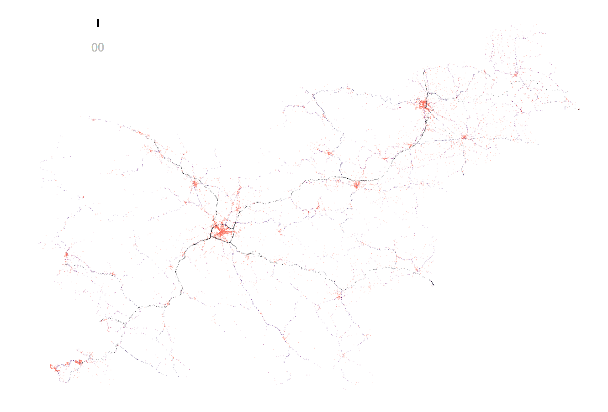

trafficaccidents
================

An R data package containing traffic accidents in Slovenia from 2005 to 2016

<!-- An R data package containing traffic accidents in Slovenia from 2005 to 2016 -->
<!-- http://bergant.github.io/trafficaccidents  -->
[](http://bergant.github.io/trafficaccidents)

Data Source
-----------

Source: <http://www.policija.si/index.php/statistika/prometna-varnost>.

Installation
------------

Install from GitHub:

``` r
#install.packages("devtools")
devtools::install_github("bergant/trafficaccidents")
```

Usage
-----

See data structure description and some visualization examples in the [usage tutorial](http://bergant.github.io/trafficaccidents).
